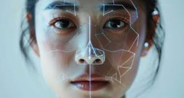

## Deepfakes Detection

👉 You can also read a translated version of this file  [한국어 버전](README_KR.md)



(image from internet)

## Contents

- [Install & Requirements](#install--requirements)
- [SetUp](#setup)
- [Deepfake Generation Models](#deepfake-generation-models)
- [Deepfake BenchMark Dataset](#deepfake-benchmark-dataset)
- [Preprocess Pipeline](#preprocess-pipeline)
- [Model Architecture](#model-architecture)
- [Model Evaluation](#model-evaluation)
- [Commit With Gitmoji](#commit-with-gitmoji)
- [Authors](#authors)
- [Acknowledgments](#acknowledgments)
- [Reference](#reference)

## Install & Requirements

To install requirements: 

```
pip install -r requirements.txt
```

## SetUp

Clone the repository and move into it:
```
git clone https://github.com/HanMoonSub/DeepGuard.git

cd DeepGuard
```

## Deepfake Generation Models

Deepfakes are synthetic media where a person's likeness is manipulated using deep learning techniques. 

#### 1. Face Swapping
| Model | Description | Notes |
|-------|-------------|-------|
| DeepFaceLab | Autoencoder-based face swapping | Commonly used for video face replacement |
| Faceswap | Open-source face swapping framework | Supports various face datasets |
| FSGAN | GAN-based face swapping | Produces high-quality face synthesis |

#### 2. Face Reenactment
| Model | Description | Notes |
|-------|-------------|-------|
| First Order Motion Model (FOMM) | Transfers facial motion from a source to a target face | Can animate expressions and lip movements |
| FaceShifter | Identity-preserving face swapping | Maintains original identity while transferring expressions |

#### 3. GAN-based Synthesis
| Model | Description | Notes |
|-------|-------------|-------|
| StyleGAN / StyleGAN2 | High-quality face image synthesis | Often used for face generation and data augmentation |
| StarGAN | Facial attribute translation | Can modify age, gender, expression, etc. |

#### 4. Tools

- Deepfakes-FaceSwap: [Github](https://github.com/deepfakes/faceswap)
- FaceSwap: [Github](https://github.com/MarekKowalski/FaceSwap/)
- FaceSwap-GAN: [Github](https://github.com/shaoanlu/faceswap-GAN)
- Face2Face: [Github](https://github.com/datitran/face2face-demo)
- DeepFaceLab: [Github](https://github.com/iperov/DeepFaceLab)


## DeepFake BenchMark Dataset
- **DFFD**:  On the Detection of Digital Face Manipulation [paper](http://cvlab.cse.msu.edu/pdfs/dang_liu_stehouwer_liu_jain_cvpr2020.pdf) [download](http://cvlab.cse.msu.edu/dffd-dataset.html)

- **Celeb-DF(v2)**: A Large-scale Challenging Dataset for DeepFake Forensics [paper](https://openaccess.thecvf.com/content_CVPR_2020/papers/Li_Celeb-DF_A_Large-Scale_Challenging_Dataset_for_DeepFake_Forensics_CVPR_2020_paper.pdf) [download](https://github.com/yuezunli/celeb-deepfakeforensics/tree/master/Celeb-DF-v2)

- **DFDC**: The DeepFake Detection Challenge(DFDC) Dataset [paper](https://arxiv.org/abs/2006.07397) [download](https://www.kaggle.com/c/deepfake-detection-challenge/data)
- **Celeb-DF++**: A Large-scale Challenging Video DeepFake Benchmark for Generalizable Forensics. [paper](https://arxiv.org/abs/2507.18015) [download](https://github.com/OUC-VAS/Celeb-DF-PP)

- **Deeper Forensics-1.0**: A Large-Scale Dataset for Real-World Face Forgery Detection [paper](https://openaccess.thecvf.com/content_CVPR_2020/papers/Jiang_DeeperForensics-1.0_A_Large-Scale_Dataset_for_Real-World_Face_Forgery_Detection_CVPR_2020_paper.pdf) [download](https://github.com/EndlessSora/DeeperForensics-1.0)

- **ForgeryNet**: A Versatile Benchmark for Comprehensive Forgery Analysis [paper](https://arxiv.org/abs/2103.05630) [download](https://github.com/yinanhe/forgerynet)

- **IDForge**: An Identity-driven Multimedia Forgery Dataset [paper](https://arxiv.org/abs/2401.11764) [download](https://github.com/xyyandxyy/IDForge)

- **Celeb-DF++**: A Large-scale Challenging Video DeepFake Benchmark for Generalizable Forensics [paper](https://arxiv.org/abs/2507.18015) [download](https://github.com/OUC-VAS/Celeb-DF-PP)


| Dataset                  | Real Videos | Fake Videos | Year | Note                                                       |
| ------------------------ | ----------: | ----------: | ---: | ---------------------------------------------------------- |
| **DFFD**                 |      1,000 |     3,000 | 2019 | multiple SOTA face manipulation methods                    |
| **Celeb-DF(v2)**         |         590 |       5,639 | 2019 | high-quality videos, improved over FaceForensics++         |
| **DFDC**                 |      23,564 |     104,500 | 2019 | Kaggle competition dataset, large-scale diverse            |
| **Deeper Forensics-1.0** |      50,000 |      10,000 | 2020 | real-world perturbations (compression, blur, etc.)         |
| **ForgeryNet**           |      99,630 |   121,617 | 2021 | comprehensive multimodal forgery benchmark (image + video) |
| **IDForge**              |       79,827 |      169,311 | 2024 | identity-driven multimedia forgery dataset                 |
| **Celeb-DF++**           |         590 |      53,196 | 2025 | large-scale, challenging, focuses on generalization        |
 
## Video Visualization Tools

### Display a Specific Frame

```
python Videos/display_img.py --video_path path/to/video.mp4 --frame 120
```
| Argument       | Description                               | Default      |
| -------------- | ----------------------------------------- | ------------ |
| `--video_path` | Path to the video file                    | *(required)* |
| `--frame`      | Frame number to display (starting from 1) | `1`          |

### Display the Entire Video

```
python Videos/display_video.py --video_path path/to/video.mp4 --width 640
```
| Argument       | Description                           | Default                |
| -------------- | ------------------------------------- | ---------------------- |
| `--video_path` | Path to the video file                | *(required)*           |
| `--width`      | Resize width (aspect ratio preserved) | `None` (original size) |


## Preprocess Pipeline

## Model Architecture

### Face-Detector

Input size for face detector was calculated for each video depending on video resolution

| Wider Side (pixels) | Scale Factor    | Description                                         |
| ------------------- | --------------- | --------------------------------------------------- |
| < 300               | 2×              | Upscale low-resolution videos by 2×                 |
| 300 – 1000          | 1× (no rescale) | Keep the original size for medium-resolution videos |
| > 1000              | 0.5×            | Downscale large-resolution videos by half           |
| > 1900              | 0.33×           | Downscale very large-resolution videos to one-third |

### Encoder

We employed EfficientNet-B5 as the encoder, a state-of-the-art architecture pretrained on ImageNet using the Noisy Student approach. The input resolution was set to the model’s native size of 384×384. Owing to memory limitations, we did not increase the input resolution for the B5 encoder.  [paper](https://arxiv.org/abs/1911.04252)
 [download](https://github.com/huggingface/pytorch-image-models)

## Model Evaluation

## Commit with Gitmoji

To maintain clear and consistent commit messages, we follow a simplified Gitmoji convention.
Each commit starts with an emoji indicating the purpose of the change.

| Emoji | Type                | Description                                      | Example                                             |
| :---: | :------------------ | :----------------------------------------------- | :-------------------------------------------------- |
|   ✨   | **feat**            | Add a new feature or script                      | `✨ Create extract_crops.py in Preprocessing Folder` |
|   🐛  | **fix**             | Fix a bug or issue                               | `🐛 Fix face detection boundary error`              |
|   🔧  | **config**          | Modify configuration or dependency               | `🔧 Update requirements.txt`                        |
|   🧹  | **refactor**        | Improve code structure without changing behavior | `🧹 Refactor preprocessing pipeline`                |
|   📝  | **docs**            | Add or update documentation                      | `📝 Update README.md`                               |
|   📁  | **chore/structure** | Move, rename, or organize files/folders          | `📁 Move display_img.py to Videos Folder`           |
|   🚀  | **deploy/run**      | Deployment or execution-related updates          | `🚀 Deploy preprocessing stage`                     |
|   ⏪   | **revert**          | Revert previous changes                          | `⏪ Revert: incorrect preprocessing logic`           |

## Authors
한문섭

이예솔

서윤제

## Acknowledgments

## Reference
