# Deepfakes Detection (ディープフェイク検出)

<p align="center">
  
  
  
  
  
  
  
</p>

<p align="center">
  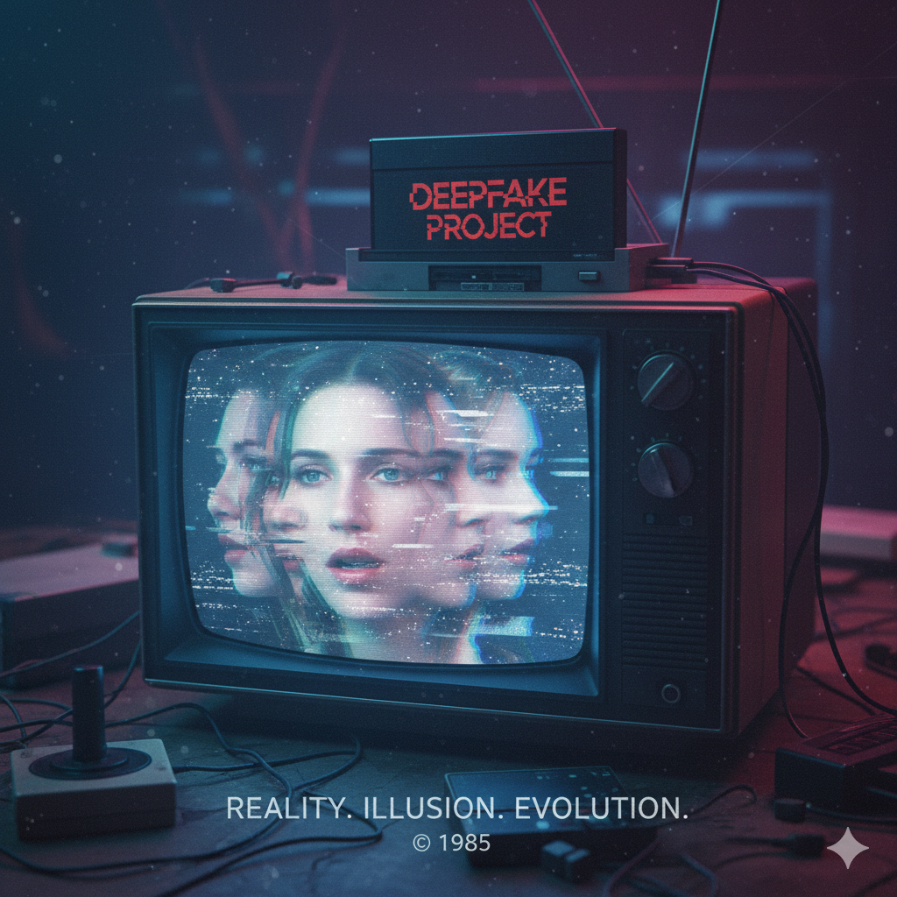
</p>

<p align="center">
  
  
  
  
</p>

<p align="center">
  
  
  
  
</p>

<p align="center">
  <a href="README.md"><b>🇺🇸 English Version</b></a> | 
  <a href="README_KR.md"><b>🇰🇷 한국어 버전</b></a> | 
  <a href="#-モデル評価"><b>📈 モデル評価</b></a> | 
  <a href="#-画像と動画の予測"><b>🔮 デモ実行</b></a>
</p>

## 📌 目次

- [💡 インストールと要件](#-インストールと要件)
- [🛠 セットアップ](#-セットアップ)
- [📚 ディープフェイク動画ベンチマークデータセット](#-ディープフェイク動画ベンチマークデータセット) — 学習に使用した Celeb-DF-v2, FF++, KoDF データセットの概要。
- [⚙️ データ準備](#データ準備) — YOLOv8 を用いた効率的な顔検出およびランドマーク抽出パイプライン。
- [🏗 モデルアーキテクチャ](#-モデルアーキテクチャ) — ハイブリッド CNN-ViT (MS-EffViT & MS-EffGCViT) 設計の詳細。
- [🧬 Model Zoo](#-model-zoo) — モデルバリアントごとのパラメータ数および演算量(FLOPs)の比較。
- [🚀 学習](#-学習) - Google Colab および W&B を活用した段階的な学習スクリプト。
- [📈 モデル評価](#-モデル評価) - ベンチマーク結果。
- [💻 モデルの使い方](#-モデルの使い方) - Python コードおよび timm を通じた DeepGuard モデルの統合方法。
- [🔮 画像と動画の予測](#-画像と動画の予測) - ディープフェイク検出のためのシンプルな推論例。
- [🎨 ディープフェイクAI説明可能性(XAI)](#-ディープフェイクai説明可能性xai) - Grad-CAM およびアテンションマップによるモデル判断根拠の可視化。
- [📓 Tutorials](#-tutorials) - 推論とデュアルブランチXAI可視化のためのハンズオンノートブック
- [📬 制作者](#-制作者)
- [📝 参考文献](#-参考文献)
- [⚖️ ライセンス](#-ライセンス)

---

## 💡 インストールと要件

必要なライブラリのインストール:

```bash
pip install -r requirements.txt
```

## 🛠 セットアップ

リポジトリをクローンし、該当ディレクトリへ移動します:
```bash
git clone https://github.com/HanMoonSub/DeepGuard.git
cd DeepGuard
```

## 📚 ディープフェイク動画ベンチマークデータセット

モデルの汎化性能と頑健性を評価するため、広く認知された3つの大規模ベンチマークデータセットを使用します。各データセットはそれぞれ異なる改ざん手法と難易度の高い課題を含んでいます。

| データセット | 実写動画 | 偽造動画 | 年度 | 参加人数 | 説明 (論文タイトル) | 詳細 |
| :--- | :---: | :---: | :---: | :---: | :--- | :---: |
| **Celeb-DF-v2** | 890 | 5,639 | 2019 | 59 | *A Large-scale Challenging Dataset for DeepFake Forensics* | [🔗 Readme](preprocess/celeb_df_v2/README.md) |
| **FaceForensics++** | 1,000 | 6,000 | 2019 | 1,000 | *Learning to Detect Manipulated Facial Images* | [🔗 Readme](preprocess/ff++/README.md) |
| **KoDF** | 62,166 | 175,776 | 2020 | 400 | *Large-Scale Korean Deepfake Detection Dataset* | [🔗 Readme](preprocess/kodf/README.md) |
 
<div id="データ準備"></div>

## ⚙️ データ準備

前処理パイプラインは、動画から顔の特徴を効率的に抽出し、高精度なディープフェイク検出に備えるよう設計されています。

### オリジナル顔の検出 (Detect Original Face)
前処理の効率を最大化するため、<ins>**顔検出はオリジナル(Real)動画に対してのみ実行されます。**</ins> ベンチマークデータセットの改ざん動画はオリジナル動画と同じ空間座標を共有するため、抽出したバウンディングボックスを偽造動画にもそのまま再利用します。

🚀 **効率化の最適化**
- **軽量モデル**: 精度を維持しつつ高速な推論を実現する `yolov8n-face` を使用します。
- **ターゲット処理**: オリジナル動画のみで顔を検出することで、全体の検出作業量を約80%削減しました。
- **動的リサイズ**: 多様な解像度で一定の推論速度を維持するため、フレームサイズに応じて自動的にサイズを調整します:

| フレームサイズ(長辺基準) | スケール係数 | 動作 |
| ------------------------ | ------------ | ------ |
|         < 300px          |      2.0     |   |
|      300px - 700px       |      1.0     |  |
|      700px - 1500px      |      0.5     |  |
|          > 1500px        |      0.33    |  | 

### 顔クロップおよびランドマーク抽出
このモジュールは、前段で生成したバウンディングボックスを用いて、オリジナル動画と偽造動画の両方から顔領域をクロップします。さらに、Landmark-based Cutout のような高度なaugmentation手法のためにランドマーク検出を行います。

🛠 **主な機能**
- **ジッターを含む動的マージン**: 顔周辺に設定可能なマージンを追加します。`margin_jitter` パラメータはクロップサイズにランダムな変化を与え、モデルが多様な顔スケールに対して頑健になるよう支援します。
- **ランドマークのローカライズ**: 5つの主要な顔ランドマーク(目、鼻、口角)を検出し、`.npy` ファイルとして保存します。

```Plaintext
DATA_ROOT/
├── crops/
│   └── {video_id}/
│       ├── 12.png
│       └── ...
├── landmarks/
│   └── {video_id}/
│       ├── 12.npy
│       └── ...
└── train_frame_metadata.csv
```

### データセット別パイプライン

各データセットの具体的な前処理の詳細は、以下のリンクをクリックしてご確認ください:

* [**Celeb-DF V2 前処理**](/preprocess/celeb_df_v2/README.md)
* [**FaceForensics++ 前処理**](/preprocess/ff++/README.md)
* [**KoDF 前処理**](/preprocess/kodf/README.md)

## 🏗 モデルアーキテクチャ

**Multi Scale Efficient Global Context Vision Transformer** は、最適化されたマルチスケール・ハイブリッドアーキテクチャです。CNN の空間的帰納バイアス(Spatial Inductive Bias)と階層的アテンション機構を統合することで、精緻な検出のために微細な(Local)アーティファクトと巨視的な(Global)アーティファクトを効果的に識別します。

#### 詳細情報

- [モデルアーキテクチャ: MS-EffViT](deepguard/MS_EffViT.md) - _**Multi Scale Efficient Vision Transformer**_
- [発展アーキテクチャ: MS-EFFGCViT](deepguard/MS_EffGCViT.md) - _**Multi Scale Efficient Global Context Vision Transformer**_


<p align="center">
  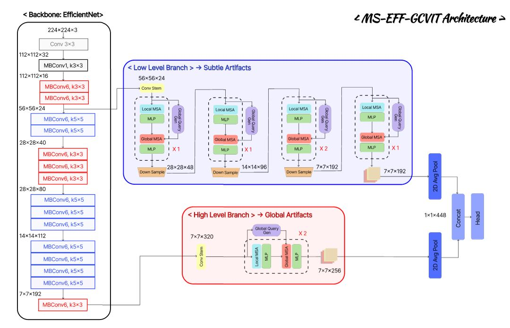
</p>

特徴マップ全体にわたって長距離(Long-range)および短距離(Short-range)の情報を共に捉えるため、2種類のセルフアテンションを活用します。

- **Local Window Attention**: 画像サイズに比例する線形計算量を維持しながら、局所的なテクスチャと精密な空間的ディテールを効率的に捉えます。
- **Global Window Attention**: Swin Transformer とは異なり、このモジュールはローカルウィンドウの Key, Value と相互作用するグローバルクエリ(Global-queries)を用います。これにより各ローカル領域が大域的なコンテキストを取り込み、長距離依存を効果的に把握して空間構造全体の包括的な理解を提供します。

<p align="center">
  
</p>

## 🧬 Model Zoo

| モデル名 | 解像度 | 総パラメータ(M) | バックボーン(M) | L-ViT(M) | H-ViT(M) | 演算量(FLOPs, G) | 設定ファイル |
| ----- | ---------- | -------------- | ----------- |------------- | ------------- | --------------  | ------- | 
| ⚡ ms_eff_gcvit_b0 | 224 X 224 | 8.7 | 3.6(41.4%) | 1.7(19.5%) | 3.3(37.9%) | 0.87 | [spec](deepguard/config/ms_eff_gcvit_b5/celeb_df_v2.yaml) |
| 🔥 ms_eff_gcvit_b5 | 384 X 384 | 50.3 | 27.3(54.3%) | 6.6(13.1%) | 16.1(32.0%) | 13.64 | [spec](deepguard/config/ms_eff_gcvit_b5/celeb_df_v2.yaml) |

## 🚀 学習

`ms_eff_vit` と `ms_eff_gcvit` の両方について学習スクリプトを提供します。無料の GPU 環境として **Google Colab** を、実験の記録およびトラッキングとして **Weights & Biases(W&B)** の使用を推奨します。

#### 📊 Weight & Biases 実験結果

* **ms_eff_vit_b0:** [Celeb-DF-v2 🚀](https://wandb.ai/origin6165/ms_eff_vit_b0_celeb_df_v2) | [FaceForensics++ 🚀](https://wandb.ai/origin6165/ms_eff_vit_b0_ff++) | [KoDF 🚀](https://wandb.ai/origin6165/ms_eff_vit_b0_kodf)
* **ms_eff_vit_b5:** [Celeb-DF-v2 🚀](https://wandb.ai/origin6165/ms_eff_vit_b5_celeb_df_v2) | [FaceForensics++ 🚀](https://wandb.ai/origin6165/ms_eff_vit_b5_ff++) | [KoDF 🚀](https://wandb.ai/origin6165/ms_eff_vit_b5_kodf)
* **ms_eff_gcvit_b0:** [Celeb-DF-v2 🚀](https://wandb.ai/origin6165/ms_eff_gcvit_b0_celeb_df_v2) | [FaceForensics++ 🚀](https://wandb.ai/origin6165/ms_eff_gcvit_b0_ff++) | [KoDF 🚀](https://wandb.ai/origin6165/ms_eff_gcvit_b0_kodf)
* **ms_eff_gcvit_b5:** [Celeb-DF-v2 🚀](https://wandb.ai/origin6165/ms_eff_gcvit_b5_celeb_df_v2) | [FaceForensics++ 🚀](https://wandb.ai/origin6165/ms_eff_gcvit_b5_ff++) | [KoDF 🚀](https://wandb.ai/origin6165/ms_eff_gcvit_b5_kodf)

```python
!python -m train_eff_vit \ # または train_eff_gcvit
    --root-dir DATA_ROOT \ 
    --model-ver "ms_eff_vit_b5" \ # ms_eff_vit_b0, ms_eff_vit_b5, ms_eff_gcvit_b0, ms_eff_gcvit_b5
    --dataset "ff++" \ # ff++, celeb_df_v2, kodf
    --seed 2025 \ # 再現性のためのシード値
    --wandb-api-key "ご自身のAPIキー" # ご自身のW&B APIキーを入力してください
```

## 📈 モデル評価

```python
!python -m inference.predict_video \
    --root-dir DATA_ROOT \
    --margin-ratio 0.2 \
    --conf-thres 0.5 \
    --min-face-ratio 0.01 \
    --model-name "ms_eff_gcvit_b0" \ # ms_eff_vit_b0, ms_eff_vit_b5, ms_eff_gcvit_b0, ms_eff_gcvit_b5
    --model-dataset "kodf" \ # ff++, celeb_df_v2, kodf
    --num-frames 20 \
    --tta-hflip 0.0 \
    --agg-mode "conf" \
```

**Celeb DF(v2) 事前学習モデル**

| モデルバージョン | Test@Acc | Test@Auc | Test@log_loss | ダウンロード | 学習レシピ |
| ------------- | -------- | -------- | ---------- | -------- | ----- |
| ms_eff_gcvit_b0 | 0.9842 | 0.9965 | 0.0283 | [model](https://github.com/HanMoonSub/DeepGuard/releases/download/v0.1.0/ms_eff_gcvit_b0_celeb_df_v2.bin) | [recipe](deepguard/config/ms_eff_gcvit_b0/celeb_df_v2.yaml) |
| ms_eff_gcvit_b5 | 0.9981 | 0.9984 | 0.0089 | [model](https://github.com/HanMoonSub/DeepGuard/releases/download/v0.1.0/ms_eff_gcvit_b5_celeb_df_v2.bin) | [recipe](deepguard/config/ms_eff_gcvit_b5/celeb_df_v2.yaml) |

**FaceForensics++ 事前学習モデル**

| モデルバージョン | Test@Acc | Test@Auc | Test@log_loss | ダウンロード | 学習レシピ |
| ------------- | -------- | -------- | ---------- | -------- | ------ |
| ms_eff_gcvit_b0 | 0.9808 | 0.9969 | 0.0637| [model](https://github.com/HanMoonSub/DeepGuard/releases/download/v0.1.0/ms_eff_gcvit_b0_ff++.bin) | [recipe](deepguard/config/ms_eff_gcvit_b0/celeb_df_v2.yaml) |
| ms_eff_gcvit_b5 | 0.9850 | 0.9974 | 0.0492 | [model](https://github.com/HanMoonSub/DeepGuard/releases/download/v0.1.0/ms_eff_gcvit_b5_ff++.bin) | [recipe](deepguard/config/ms_eff_gcvit_b5/celeb_df_v2.yaml) |

**KoDF 事前学習モデル**

| モデルバージョン | Test@Acc | Test@Auc | Test@log_loss | ダウンロード | 学習レシピ |
| ------------- | -------- | -------- | ---------- | -------- | ------ |
| ms_eff_gcvit_b0 | 0.9655 | 0.9792 | 0.1237 | [model](https://github.com/HanMoonSub/DeepGuard/releases/download/v0.2.0/ms_eff_gcvit_b0_kodf.bin) | [recipe](deepguard/config/ms_eff_gcvit_b0/celeb_df_v2.yaml) |
| ms_eff_gcvit_b5 | 0.9850 | 0.9974 | 0.0492 | [model](https://github.com/HanMoonSub/DeepGuard/releases/download/v0.2.0/ms_eff_gcvit_b5_kodf.bin) | [recipe](deepguard/config/ms_eff_gcvit_b5/celeb_df_v2.yaml) |

## 💻 モデルの使い方

**クイックスタート**
`DeepGuard` パッケージを直接インポートするか、`timm` インターフェースを通じてモデルをロードできます。

**対応データセット**: `celeb_df_v2`, `ff++`, `kodf`

**インストール**

```bash
# pip install -U git+https://github.com/HanMoonSub/DeepGuard.git
pip install deepguard
```


**方法 A: 直接インポート (DeepGuard 使用)**

```python
from deepguard import ms_eff_gcvit_b0, ms_eff_gcvit_b5

model = ms_eff_gcvit_b0(pretrained=True, dataset="celeb_df_v2")
model = ms_eff_gcvit_b5(pretrained=True, dataset="ff++")
```

**方法 B: timm インターフェース使用**

```python
import timm
import deepguard

model = timm.create_model("ms_eff_gcvit_b0", pretrained=True, dataset="ff++")
model = timm.create_model("ms_eff_gcvit_b5", pretrained=True, dataset="kodf")
```

**方法 C: Hugging Face Hub**

```python
import torch
from huggingface_hub import hf_hub_download
from deepguard import ms_eff_gcvit_b0  # or ms_eff_gcvit_b5

REPO_ID = "KoreaPeter/ms-eff-gcvit-deepfake"

ckpt = hf_hub_download(REPO_ID, "ms_eff_gcvit_b0_kodf.bin")  # celeb_df_v2 | ff++ | kodf
model = ms_eff_gcvit_b0(pretrained=False)
model.load_state_dict(torch.load(ckpt, map_location="cpu"))
model.eval()
```

## 🔮 画像と動画の予測

#### ディープフェイク画像の予測

```python
from inference.image_predictor import ImagePredictor

# 予測器の初期化
predictor = ImagePredictor(
            margin_ratio = 0.2, # 検出された顔クロップ周辺のマージン比率
            conf_thres = 0.5, # 顔検出の信頼度しきい値
            min_face_ratio = 0.01, # 処理対象とするフレーム比の最小顔サイズ比率
            model_name = "ms_eff_vit_b0", # ms_eff_vit_b5, ms_eff_gcvit_b0, ms_eff_gcvit_b5 から選択
            dataset = "celeb_df_v2" # ff++, kodf データセットから選択
            )

# 推論の実行
result = predictor.predict_img(
            img_path="path/to/image.jpg",
            tta_hflip=0.0 # テスト時augmentation(TTA)用の水平反転確率
            )

print(f"ディープフェイク確率: {result:.4f}")
```

#### ディープフェイク動画の予測

```python
from inference.video_predictor import VideoPredictor

# 予測器の初期化
predictor = VideoPredictor(
            margin_ratio = 0.2, # 検出された顔クロップ周辺のマージン比率
            conf_thres = 0.5, # 顔検出の信頼度しきい値
            min_face_ratio = 0.01, # 処理対象とするフレーム比の最小顔サイズ比率
            model_name = "ms_eff_vit_b0", # ms_eff_vit_b5, ms_eff_gcvit_b0, ms_eff_gcvit_b5 から選択
            dataset = "celeb_df_v2" # ff++, kodf データセットから選択
            )

# 推論の実行
result = predictor.predict_video(
            video_path = "path/to/video.mp4",
            num_frames = 20, # 動画あたりのサンプリングフレーム数
            agg_mode = "conf", # 集約方式: 'conf', 'mean', 'vote'
            tta_hflip=0.0 # テスト時augmentation(TTA)用の水平反転確率
            )

print(f"ディープフェイク確率: {result:.4f}")
```

## 🎨 ディープフェイクAI説明可能性(XAI)

ディープフェイク検出は、その判断根拠が説明可能であって初めて信頼に値します。DeepGuard は、モデルがどの顔を *どこで、なぜ* 改ざんと判断したのかを可視化する **プロダクションレベルの XAI ツールキット** を統合し、ブラックボックスのスコアを実用的なフォレンジック証拠へと転換します。

⭐ ハイブリッド CNN-ViT アーキテクチャ、特に `MS-EffViT` と `MS-EffGCViT` で検証済みです。  
⭐ **デュアルブランチ分析(Dual-Branch Analysis)**: デュアルブランチ設計は、モデル自身のマルチスケール推論方式をそのまま反映します。

### 🧠 デュアルブランチ XAI の仕組み

<p align="center">
  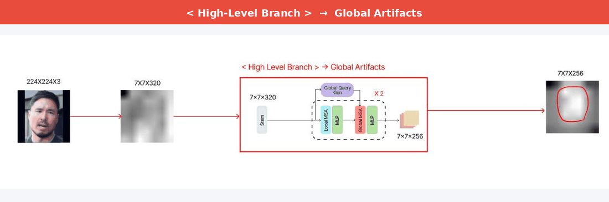
</p>

| ブランチ | 特徴マップ | 焦点 | 最適な用途 |
| ------ | ----------- | ----- | -------- |
|  | 高解像度 | 局所的な偽造アーティファクト | 肌のテクスチャ、境界のブレンディング、圧縮痕跡 |
|  | 低解像度 | 大域的な意味構造 | 照明の不整合、顔の幾何構造、影のアーティファクト |

### 📐 XAI 手法

各手法は、経験的に最も高い性能を示すブランチに割り当てられています。

| ブランチ | 手法 | 🎯 コアアイデア |
| :--- | :--- | :--- |
| **`low level`** | **HiResCAM** | GradCAM に似ているが、活性化(activation)と勾配を要素ごと(element-wise)に乗算する。特定のモデルに対して忠実性(faithfulness)が理論的に保証される |
| **`low level`** | **GradCAMElementWise** | GradCAM に似ているが、活性化と勾配を要素ごとに乗算した後、総和を取る前に ReLU を適用する |
| **`low level`** | **LayerCAM** | 正の勾配で活性化に空間的な重み付けを行う。特に下位層でより良く機能する |
| **`high level`** | **EigenGradCAM** | EigenCAM に似ているがクラス判別性を追加: (活性化×勾配)の第1主成分(First principal component)。GradCAM に近いがよりクリーン |
| **`high level`** | **GradCAM++** | GradCAM に似ているが2次勾配(second order gradients)を使用する |
| **`high level`** | **XGradCAM** | GradCAM に似ているが、正規化された活性化で勾配をスケーリングする |

- **`aug_smooth`**: CAM を平均化する前に TTA(水平反転)を適用 → より滑らかで対象によく整列したマップを生成
- **`eigen_smooth`**: PCA ノイズ除去を適用 → 支配的な偽造パターンのみを保持

### 💡 ディープフェイク XAI の使い方

**Low-Level ブランチ — 局所的アーティファクト検出**

```python
from explainability import HiResCAMExplainer, GradCAMElementWiseExplainer, LayerCAMExplainer

explainer = HiResCAMExplainer(
    model_name   = "ms_eff_gcvit_b0",  # ms_eff_vit_b0, ms_eff_gcvit_b5, ms_eff_vit_b5 から選択
    dataset      = "celeb_df_v2",       # ff++, kodf から選択
    branch_level = "low",
)
```

**High-Level ブランチ — 大域的意味構造検出**
```python
from explainability import EigenGradCAMExplainer, GradCAMPlusPlusExplainer, XGradCAMExplainer

explainer = EigenGradCAMExplainer(
    model_name   = "ms_eff_gcvit_b0",
    dataset      = "celeb_df_v2",
    branch_level = "high",
)
```

### 🎨 可視化モード

<p align="center">
  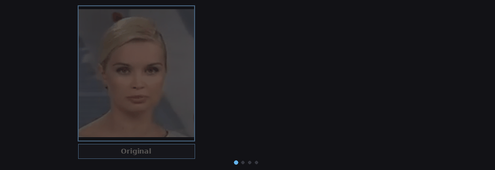
</p>

**1. Heatmap — 連続的な活性化分布**

```python
result = explainer.display_heatmap_on_image(
    img_path     = "path/to/image.jpg",
    category     = 1,      # 0: Real, 1: Fake
    threshold    = 0.5,    # 二値化カットオフ (0.5~1.0)、またはOtsu自動しきい値は "auto"
    image_weight = 0.5,    # 0.0: ヒートマップのみ ← → 1.0: 元画像のみ
    aug_smooth   = False,  # TTAスムージング ('pro'モデルは非対応)
    eigen_smooth = False,  # PCAノイズ除去
)
```

**2. Bounding Box — 離散的な偽造領域のローカライズ**

```python
result = explainer.display_bbox_on_image(
    img_path     = "path/to/image.jpg",
    category     = 1,
    threshold    = 0.5,
    thickness    = 1,
    aug_smooth   = False,
    eigen_smooth = False,
)
```

**3. Heatmap + BBox — 統合オーバーレイ (レポート作成時に推奨)**
```python
result = explainer.display_heatmap_bbox_on_image(
    img_path     = "path/to/image.jpg",
    category     = 1,
    threshold    = 0.5,
    image_weight = 0.5,
    aug_smooth   = False,
    eigen_smooth = False,
)
```

### 📊 可視化結果

<p align="center">
  <table>
    <tr>
      <td>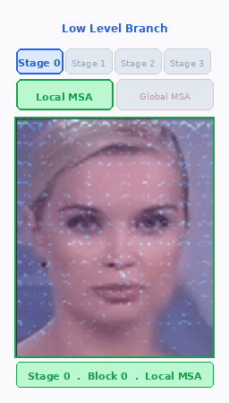</td>
      <td width="20%"></td>
      <td>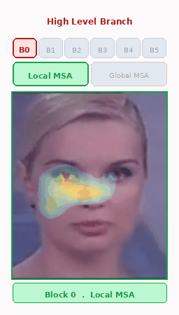</td>
    </tr>
  </table>
</p>


#### MS-EFF-VIT — Low-Level Branch

| Model | Branch-Level | Image | HiresCam | GradCamElementwise | LayerCam |
| :--- | :---: | :---: | :---: | :---: | :---: |
| **⚡ ms-eff-vit-b0** |  | 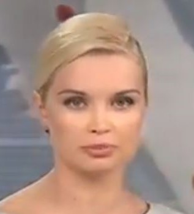 | 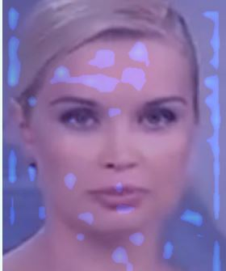 | 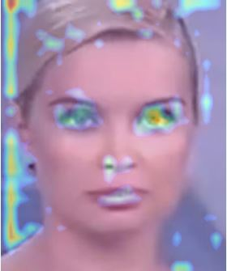 | 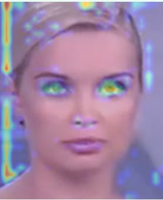 |
| **🔥 ms-eff-vit-b5** |  |  | 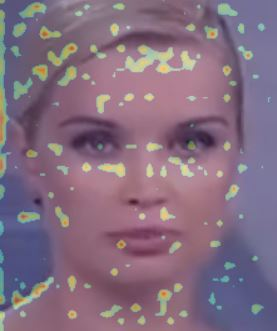 | 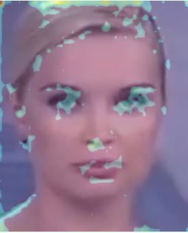 | 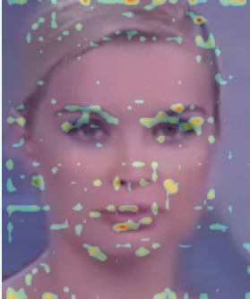 |

#### MS-Eff-ViT — High-Level Branch

| Model | Branch-Level | Image | EigenGradCam | GradCamPlusPlus | XGradCam |
| :--- | :---: | :---: | :---: | :---: | :---: |
| **⚡ ms-eff-vit-b0** |  |  | 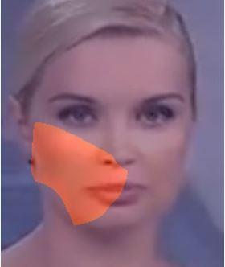 | 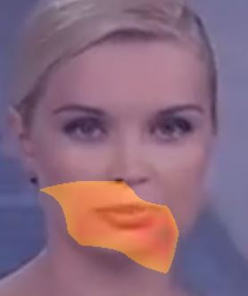 | 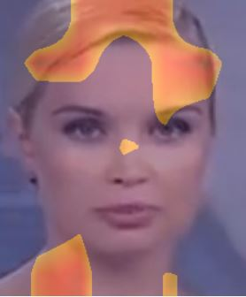 |
| **🔥 ms-eff-vit-b5** |  |  | 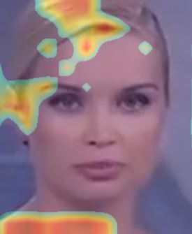 | 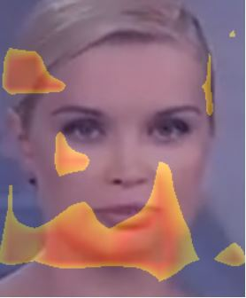 | 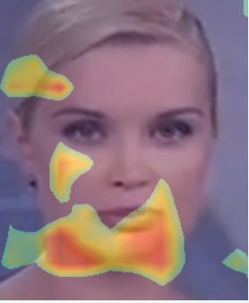 |

#### MS-EFF-GCVIT — Low-Level Branch

| Model | Branch-Level | Image | HiresCam | GradCamElementwise | LayerCam |
| :--- | :---: | :---: | :---: | :---: | :---: |
| **⚡ ms-eff-gcvit-b0** |  |  | 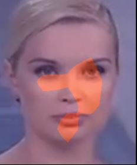 | 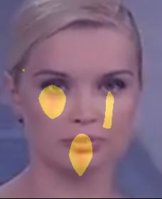 | 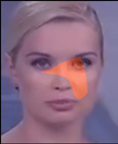 |
| **🔥 ms-eff-gcvit-b5** |  |  | 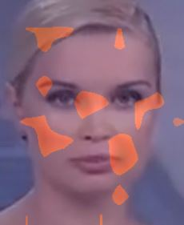 | 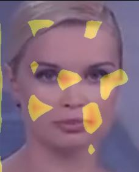 | 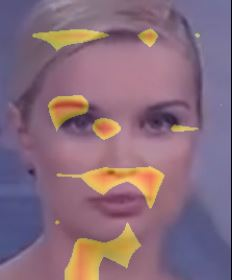 |

#### MS-Eff-GCViT — High-Level Branch

| Model | Branch-Level | Image | EigenGradCam | GradCamPlusPlus | XGradCam |
| :--- | :---: | :---: | :---: | :---: | :---: |
| **⚡ ms-eff-gcvit-b0** |  |  | 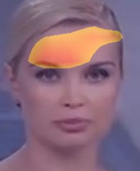 | 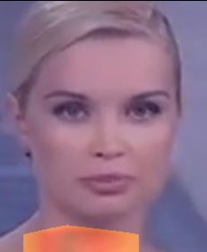 | 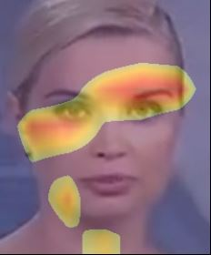 |
| **🔥 ms-eff-gcvit-b5** |  |  | 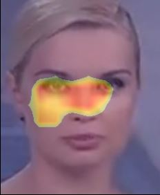 | 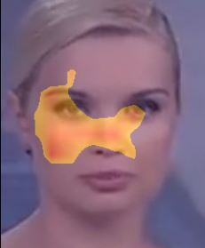 | 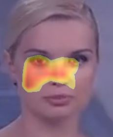 |

## 📓 Tutorials

Jupyterノートブックは、gitリポジトリのtutorialsフォルダ内にあります。

- [Notebook tutorial: Predict DeepFake Image with ImagePredictor](./tutorials/predict_image.ipynb)
- [Notebook tutorial: Predict DeepFake Video with VideoPredictor](./tutorials/predict_video.ipynb)
- [Notebook tutorial: Low-Level Branch XAI Visualization (HiResCAM, GradCAMElementWise, LayerCAM)](./tutorials/low_level_visualization.ipynb)
- [Notebook tutorial: High-Level Branch XAI Visualization (EigenGradCAM, GradCAM++, XGradCAM)](./tutorials/high_level_visualization.ipynb)
- [Notebook tutorial: MS-EffViT Low-Level Branch Explainability](./tutorials/ms_eff_vit_low_level.ipynb)
- [Notebook tutorial: MS-EffViT High-Level Branch Explainability](./tutorials/ms_eff_vit_high_level.ipynb)
- [Notebook tutorial: MS-EffGCViT Low-Level Branch Explainability](./tutorials/ms_eff_gcvit_low_level.ipynb)
- [Notebook tutorial: MS-EffGCViT High-Level Branch Explainability](./tutorials/ms_eff_gcvit_high_level.ipynb)

## 📬 制作者

_**本プロジェクトは、忠北大学校(CBNU)ソフトウェア学部の卒業制作(Senior Graduation Project)として開発されました。**_

* **ハン・ムンソプ(한문섭)**: **Data & Backend Engineering** (データ前処理パイプライン、DBスキーマ設計) — [hanmoon3054@gmail.com](mailto:hanmoon3054@gmail.com)
* **イ・イェソル(이예솔)**: **UI/UX & Frontend Engineering** (UI/UXデザイン、ユーザーダッシュボード、モデル可視化) — [yesol4138@chungbuk.ac.kr](mailto:yesol4138@chungbuk.ac.kr)
* **ソ・ユンジェ(서윤제)**: **AI Engineering** (AIモデルアーキテクチャ設計、推論API設計、モデルサービング) — [seoyunje2001@gmail.com](mailto:seoyunje2001@gmail.com)


## 📝 参考文献

1. [`facenet-pytorch`](https://github.com/timesler/facenet-pytorch) - _Tim Esler による事前学習済み顔検出(MTCNN)および認識(InceptionResNet)モデル_
2. [`face-cutout`](https://github.com/sowmen/face-cutout) - _Sowmen による Face Cutout ライブラリ_
3. [`Celeb-DF++`](https://github.com/OUC-VAS/Celeb-DF-PP) - _OUC-VAS Group による Celeb-DF++ データセット_
4. [`DeeperForensics-1.0`](https://github.com/EndlessSora/DeeperForensics-1.0) - _Endless Sora による DeeperForensics-1.0 データセット_
5. [`Deepfake Detection`](https://github.com/abhijithjadhav/Deepfake_detection_using_deep_learning) - _Abhijith Jadhav による ResNext と LSTM を用いた動画ディープフェイク検出_
6. [`deepfake-detection-project-v4`](https://github.com/ameencaslam/deepfake-detection-project-v4) - _Ameen Caslam による複数のディープラーニングモデル_
7. [`Awesome-Deepfake-Detection`](https://github.com/Daisy-Zhang/Awesome-Deepfakes-Detection) - _Daisy Zhang がまとめたツール・論文・コードのキュレーションリスト_
8. [`Pytorch-Grad-Cam`](https://github.com/jacobgil/pytorch-grad-cam) - _PyTorch モデルのための高度な視覚的説明ツール_

## ⚖️ ライセンス 

本プロジェクトは MIT ライセンスの条件の下で配布されます。