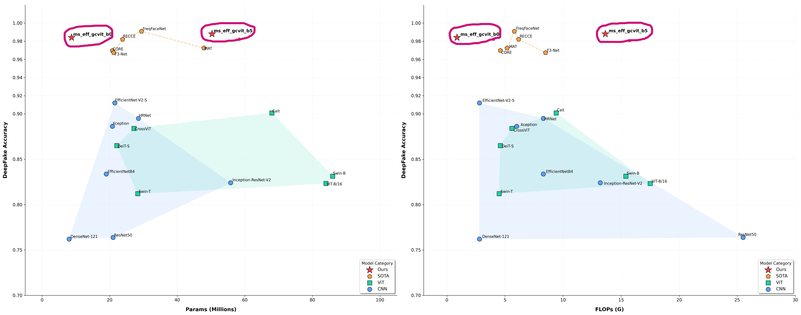

# 🚀 Multi Scale Efficient Global Context Vision Transformer

This Repository presents the PyTorch implementation of **Multi Scale Efficient Global Context Vision Transformer**, a hybrid architecture optimized for **deepfake detection task**.

This model is a **frame-level** and **spatial-domain** architecture, designed to perform classification tasks on both **static images** and **video sequences**

## 💥 News 💥

- [**02.28.2026**] 🔥🔥🔥 We have released **KoDF** fine-tuned **MS-Eff-GCViT B5** model weightes for **384X384**
- [**02.28.2026**] 🔥🔥🔥 We have released **KoDF** fine-tuned **MS-Eff-GCViT B0** model weightes for **224X224**
- [**02.03.2026**] 🔥🔥 We have released **FaceForensics++** fine-tuned **MS-Eff-GCViT B5** model weightes for **384X384**
- [**02.03.2026**] 🔥🔥 We have released **Celeb DF(V2)** fine-tuned **MS-Eff-GCViT B5** model weightes for **384X384**
- [**02.03.2026**] 🔥 We have released **FaceForensics++** fine-tuned **MS-Eff-GCViT B0** model weightes for **224X224**
- [**02.03.2026**] 🔥 We have released **Celeb DF(V2)** fine-tuned **MS-Eff-GCViT B0** model weightes for **224X224**

## Model Performance




## Model Indroduction

Multi Scale Efficient Global Context Vision Transformer is an optimized multi-scale hybrid architecture that integrates CNN-driven spatial inductive bias with hierarchical attention mechanisms to effectively identify microscopic local artifacts and macroscopic structural inconsistencies for robust deepfake forensics."

<details>
<summary><span style="font-size: 1.25em; font-weight: bold;">Part 1: CNN-based Patch Embedding for Spatial Inductive Bias</span></summary>

While traditional Vision Transformers (ViTs) utilize a Linear Projection for patch embedding, our proposed model adopts a CNN-based Patch Embedding module incorporating MBConvBlocks.

- **Injecting Inductive Bias** : Standard ViTs often suffer from a lack of inherent spatial inductive bias, typically necessitating massive datasets to learn fundamental visual structures from scratch. In contrast, our CNN-based module leverages overlapping receptive fields to facilitate information sharing between neighboring patches. By explicitly injecting this spatial bias into the architecture, the model achieves more stable and accelerated convergence during the training process.
</details>


<details>
<summary><span style="font-size: 1.25em; font-weight: bold;">Part 2: Long-Short Range Spatial Interaction</span></summary>

We utilizes two distinct types of self-attention to capture both long-range and short-range information across multi-scale feature maps.

- **Local Window Attention**: this model efficiently captures local textures and precise spatial details while maintaining linear computational complexity relative to the image size.

- **Global Window Attention**: Unlike Swin Transformer, this module utilizes global-queries that interact with local window keys and values. This allows each local region to incorporate global context, effectively capturing long-range dependencies and providing a comprehensive understanding of the entire spatial structure
</details>

<details>
<summary><span style="font-size: 1.25em; font-weight: bold;">Part 3: Computational Efficiency</span></summary>

- **Efficient Backbone**
While both **Xception** and **EfficientNet** show great results on DeepFake benchmarks, **EfficientNet** is chosen for its superior computational efficiency. By utilizing **MBconv (Inverted Residual Blocks)** and depthwise convolutions, it achieves significantly lower FLOPS compared to Xception.

- **Window-based Attention**: Instead of applying self-attention on raw images, this model operates on feature maps extracted from backbone blocks. By partitioning these maps into windows, the $O(N^2)$ complexity is restricted to the window size, siginificantly lowering the computational footprint.
</details>

<details>
<summary><span style="font-size: 1.25em; font-weight: bold;">Part 4: Multi-Scale Feature Map Fusion</span></summary>

Modern DeepFakes can leave very localized forgery region. To Capture this, we adopts a **multi-scale strategy** by extracting features from different levels of the backbone.

- ** (_Subtle Artifacts_)**: High-Resolution feature maps are extracted from early backbone blocks(`l_block_idx`) to capture like skin texture or boundary artifacts

- ** (_Global Features_)**: Low-Resolution feature maps are extracted from deeper blocks(`h_block_idx`) to analyze overall lighting, shadows, and structural consistency.

- **Feature Fusion**: The Outputs from both branches (`L-GCViT and H-GCViT`) are fused to make a comprehensive decision based on both local and global context.
</details>

## 📊 Model Zoo

| Model | Resolution | # Total Params(M) | # Backbone(M) | # L-ViT(M) | # H-ViT(M)  | FLOPs (G) | Model Config |
| ----- | ---------- | -------------- | ----------- |------------- | ------------- | --------------  | ------- | 
| ⚡ ms_eff_gcvit_b0 | 224 X 224 | 8.7 | 3.6(41.4%) | 1.7(19.5%) | 3.3(37.9%) | 0.87 |  [spec](./config/ms_eff_gcvit_b5/celeb_df_v2.yaml) |
| 🔥 ms_eff_gcvit_b5 | 384 X 384 | 50.3 | 27.3(54.3%) | 6.6(13.1%) | 16.1(32.0%) | 13.64 | [spec](./config/ms_eff_gcvit_b5/celeb_df_v2.yaml) |


## 🛠 Model Variants

**⚡ ms_eff_gcvit_b0 (Fast Mode / Mobile)**: Efficiency at the Edge
- Optimized for **real-time inference** and mobile deployment.

**🔥 ms_eff_gcvit_b5 (Pro Mode / Enterprise)**: Uncompromising Precision
- Engineered for high-fidelity analysis and enterprise-grade accuracy.

## ⚙️ Model Weight Initialization
The model incorporates a hybrid initialization strategy to leverage pre-trained features while ensuring stable convergence of the transformer components

> **Backbone**: **ImageNet-1K Pretraiend Weights**(EfficientNet)  

> **L-GCViT / H-GCViT / Head**: Truncated Normal( `std=0.02` )
 
> **No Weight Decay**: `relative_position_bias_table`, `bn`, `norm`


## DeepFake Video Benchmarks

🔥 **Celeb-DF(v2)**: A Large-scale Challenging Dataset for DeepFake Forensics [paper](https://openaccess.thecvf.com/content_CVPR_2020/papers/Li_Celeb-DF_A_Large-Scale_Challenging_Dataset_for_DeepFake_Forensics_CVPR_2020_paper.pdf) [download](https://github.com/yuezunli/celeb-deepfakeforensics/tree/master/Celeb-DF-v2)

🔥 **FaceForensics++**: Learning to Detect Manipulated Facial Images [paper](https://arxiv.org/abs/1901.08971) [download](https://github.com/ondyari/FaceForensics)

🔥 **KoDF**: Large-Scale Korean DeepFake Detection Dataset [paper](https://aihub.or.kr/aihubdata/data/view.do?currMenu=115&topMenu=100&searchKeyword=%EB%94%A5%ED%8E%98%EC%9D%B4%ED%81%AC%20%EB%B3%80%EC%A1%B0%20%EC%98%81%EC%83%81&aihubDataSe=data&dataSetSn=55) [download](https://aihub.or.kr/aihubdata/data/view.do?currMenu=115&topMenu=100&searchKeyword=%EB%94%A5%ED%8E%98%EC%9D%B4%ED%81%AC%20%EB%B3%80%EC%A1%B0%20%EC%98%81%EC%83%81&aihubDataSe=data&dataSetSn=55)

**Celeb DF(v2) Pretrained Models**

| Model Variant | Test@Acc | Test@Auc | Test@log_loss | Download | Train Config |
| ------------- | -------- | -------- | ---------- | -------- | ----- |
| ms_eff_gcvit_b0 | 0.9842 | 0.9882 | 0.0408 | [model](https://github.com/HanMoonSub/DeepGuard/releases/download/v0.1.0/ms_eff_gcvit_b0_celeb_df_v2.bin) | [recipe](./config/ms_eff_gcvit_b0/celeb_df_v2.yaml) |
| ms_eff_gcvit_b5 | 0.9881 | 0.9900 | 0.0385 | [model](https://github.com/HanMoonSub/DeepGuard/releases/download/v0.1.0/ms_eff_gcvit_b5_celeb_df_v2.bin) | [recipe](./config/ms_eff_gcvit_b5/celeb_df_v2.yaml) |

**FaceForensics++ Pretrained Models**

| Model Variant | Test@Acc | Test@Auc | Test@log_loss | Download | Train Config |
| ------------- | -------- | -------- | ---------- | -------- | ------ |
| ms_eff_gcvit_b0 | 0.9808 | 0.9969 | 0.0637| [model](https://github.com/HanMoonSub/DeepGuard/releases/download/v0.1.0/ms_eff_gcvit_b0_ff++.bin) | [recipe](./config/ms_eff_gcvit_b0/celeb_df_v2.yaml) |
| ms_eff_gcvit_b5 | 0.9850 | 0.9974 | 0.0492 | [model](https://github.com/HanMoonSub/DeepGuard/releases/download/v0.1.0/ms_eff_gcvit_b5_ff++.bin) | [recipe](./config/ms_eff_gcvit_b5/celeb_df_v2.yaml) |

**KoDF Pretrained Models**

| Model Variant | Test@Acc | Test@Auc | Test@log_loss | Download | Train Config |
| ------------- | -------- | -------- | ---------- | -------- | ------ |
| ms_eff_gcvit_b0 | 0.9655 | 0.9792 | 0.1237 | [model](https://github.com/HanMoonSub/DeepGuard/releases/download/v0.2.0/ms_eff_gcvit_b0_kodf.bin) | [recipe](./config/ms_eff_gcvit_b0/celeb_df_v2.yaml) |
| ms_eff_gcvit_b5 | 0.9850 | 0.9974 | 0.0492 | [model](https://github.com/HanMoonSub/DeepGuard/releases/download/v0.2.0/ms_eff_gcvit_b5_kodf.bin) | [recipe](./config/ms_eff_gcvit_b5/celeb_df_v2.yaml) |

## Usage

**Quick Start**
You can load the models directly via the `DeepGuard` package or through the `timm` interface.

**Available Datasets**: `celeb_df_v2`, `ff++`, `kodf`

**Installation**

```bash
pip install -U git+https://github.com/HanMoonSub/DeepGuard.git
```


**Option A: Direct Import (via DeepGuard)**

```python
from deepguard import ms_eff_gcvit_b0, ms_eff_gcvit_b5

model = ms_eff_gcvit_b0(pretrained=True, dataset="celeb_df_v2")
model = ms_eff_gcvit_b5(pretrained=True, dataset="ff++")
```

**Option B: Using timm Interface (via timm)**

```python
import timm
import deepguard

model = timm.create_model("ms_eff_gcvit_b0", pretrained=True, dataset="ff++")
model = timm.create_model("ms_eff_gcvit_b5", pretrained=True, dataset="kodf")
```