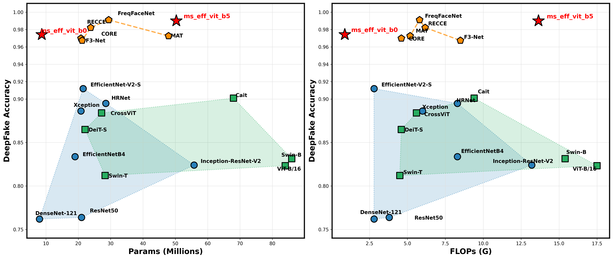
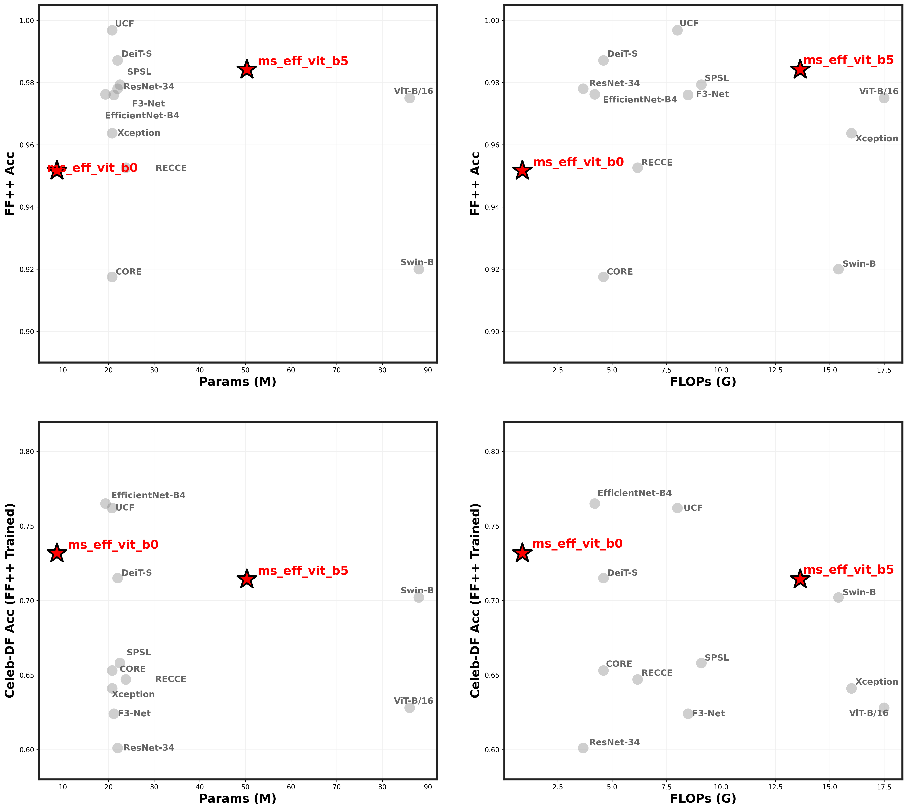

# 🚀 Multi Scale Efficient Vision Transformer


-green?style=flat-square)


This Repository presents the PyTorch implementation of **Multi Scale Efficient Vision Transformer**, a hybrid architecture optimized for **deepfake detection task**

This model is a **frame-level** and **spatial-domain** architecture, designed to perform classification tasks on both **static images** and **video sequences**

## 💥 News 💥

- [**02.03.2026**] 🔥🔥 We have released **FaceForensics++** fine-tuned **MS-Eff-ViT B5** model weightes for **384X384**
- [**02.03.2026**] 🔥🔥 We have released **Celeb DF(V2)** fine-tuned **MS-Eff-ViT B5** model weightes for **384X384**
- [**02.03.2026**] 🔥 We have released **FaceForensics++** fine-tuned **MS-Eff-ViT B0** model weightes for **224X224**
- [**02.03.2026**] 🔥 We have released **Celeb DF(V2)** fine-tuned **MS-Eff-ViT B0** model weightes for **224X224**

## Model Performance

MS_Eff_ViT achieves state-of-the-art(SOTA) results across deepfake video classification. On Celeb_DF(v2) dataset, MS_EFF_GCViT variants with `5.9M`, `52.0M` parameters achieve `0.9742`, `0.9900` Accuracy. Notably, the MS_EFF_ViT_B0 variant demonstrates exceptional efficiency, matching or exceeding SOTA performance even with a siginificantly lower parameter


### Test Result of Celeb_DF(v2)



<details>
<summary><span style="font-size: 1.25em; font-weight: bold;">Test Result of FaceForensics++</span></summary>

</details>

## Model Introduction

Multi Scale Efficient Vision Transformer is an optimized multi-scale hybrid architecture that integrates CNN-driven spatial inductive bias with self-attention mechanisms to effectively identify subtle(local) artifacts and macro(global) artifacts for robust deepfake forensics."

### Part 1: CNN-based Patch Embedding for Spatial Inductive Bias

While traditional Vision Transformers (ViTs) utilize a Linear Projection for patch embedding, our proposed model adopts a CNN-based Patch Embedding module incorporating MBConvBlocks.

- **Injecting Inductive Bias** : Standard ViTs often suffer from a lack of inherent spatial inductive bias, typically necessitating massive datasets to learn fundamental visual structures from scratch. In contrast, our CNN-based module leverages overlapping receptive fields to facilitate information sharing between neighboring patches. By explicitly injecting this spatial bias into the architecture, the model achieves more stable and accelerated convergence during the training process.

### Part 2: CNN + Transformer

Our model combines Convolutional Neural Networks (CNNs) and Vision Transformers (ViTs) to capture both fine-grained local textures and broad global contexts. we apply Global Self-Attention directly to the feature maps generated by the CNN backbone.

- ** (_CNN Backbone_)**:
The model first utilizes a CNN backbone to extract high-dimensional feature maps. By leveraging the inductive bias of convolutions—such as locality and translation invariance—the model effectively captures precise spatial details, edges, and local patterns that are often missed by pure Transformer architectures.

- ** (_Transformer Encoder_)**:
The feature maps from the CNN are flattened into a sequence of tokens and passed through a Multi-Head Self-Attention (MHSA) module. This Module captures long-range dependencies and provides a holistic understanding of the image's global structure and the relationships between distant objects.

### Part 3: Multi-Scale Feature Map Fusion

Modern DeepFakes can leave very localized forgery region. To Capture this, we adopts a **multi-scale strategy** by extracting features from different levels of the backbone.

- ** (_Subtle Artifacts_)**: High-Resolution feature maps are extracted from early backbone blocks(`l_block_idx`) to capture like skin texture or boundary artifacts

- ** (_Global Features_)**: Low-Resolution feature maps are extracted from deeper blocks(`h_block_idx`) to analyze overall lighting, shadows, and structural consistency.

- **Feature Fusion**: The Outputs from both branches (`L-ViT and H-ViT`) are fused to make a comprehensive decision based on both local and global context.


## 📊 Model Zoo

| Model | Resolution | # Total Params(M) | # Backbone(M) | # L-ViT(M) | # H-ViT(M)  | FLOPs (G) | Model Config |
| ----- | ---------- | ---------- | ------------------------- | ------------- | --------------  | ------- | ------- |
| ⚡ ms_eff_vit_b0 | 224 X 224 | 5.9 | 3.6(61%) | 0.5(8.5%) | 1.7(29%) | 0.68 | [spec](./config/ms_eff_vit_b0/celeb_df_v2.yaml) |
| 🔥 ms_eff_vit_b5 | 384 X 384 | 52.0 | 27.3(52.5%) | 4.7(9%) | 19.7(37.9%) | 15.22 | [spec](./config/ms_eff_vit_b5/celeb_df_v2.yaml) |

## 🛠 Model Variants 

**⚡ ms_eff_vit_b0 (Fast Mode / Mobile)**: Efficiency at the Edge
- Optimized for **real-time inference** and mobile deployment.

**🔥 ms_eff_vit_b5 (Pro Mode / Enterprise)**: Uncompromising Precision
- Engineered for high-fidelity analysis and enterprise-grade accuracy.

## ⚙️ Model Weight Initialization
The model incorporates a hybrid initialization strategy to leverage pre-trained features while ensuring stable convergence of the transformer components

> **Backbone**: **ImageNet-1K Pretraiend Weights**(EfficientNet)  

> **L-ViT / H-ViT / Head**: Truncated Normal( `std=0.02` )
 
> **No Weight Decay**: `pos-embed`, `cls-token`, `bn`, `norm`

## DeepFake Video Benchmarks

🔥 **Celeb-DF(v2)**: A Large-scale Challenging Dataset for DeepFake Forensics [paper](https://openaccess.thecvf.com/content_CVPR_2020/papers/Li_Celeb-DF_A_Large-Scale_Challenging_Dataset_for_DeepFake_Forensics_CVPR_2020_paper.pdf) [download](https://github.com/yuezunli/celeb-deepfakeforensics/tree/master/Celeb-DF-v2)

🔥 **FaceForensics++**: Learning to Detect Manipulated Facial Images [paper](https://arxiv.org/abs/1901.08971) [download](https://github.com/ondyari/FaceForensics)


**Celeb DF(v2) Pretrained Models**

| Model Variant | Test@Acc | Test@Auc | Test@log_loss | Download | Train Config |
| ------------- | -------- | -------- | ---------- | -------- | ----- |
| ms_eff_vit_b0 | 0.9742 | 0.9877 | 0.0625 | [model](https://github.com/HanMoonSub/DeepGuard/releases/download/v0.1.0/ms_eff_vit_b0_celeb_df_v2.bin) | [recipe](./config/ms_eff_vit_b0/celeb_df_v2.yaml) |
| ms_eff_vit_b5 | 0.9900 | 0.9900 | 0.0408 |[model](https://github.com/HanMoonSub/DeepGuard/releases/download/v0.1.0/ms_eff_vit_b5_celeb_df_v2.bin) | [recipe](./config/ms_eff_vit_b5/celeb_df_v2.yaml) |

**FaceForensics++ Pretrained Models**

| Model Variant | Test@Acc | Test@Auc | Test@log_loss | Download | Train Config |
| ------------- | -------- | -------- | ---------- | -------- | ------ |
| ms_eff_vit_b0 | 0.9517 | 0.9860 | 0.1334 | [model](https://github.com/HanMoonSub/DeepGuard/releases/download/v0.1.0/ms_eff_vit_b0_ff++.bin) | [recipe](./config/ms_eff_vit_b0/celeb_df_v2.yaml) |
| ms_eff_vit_b5 | 0.9842 | 0.9977 | 0.0477 | [model](https://github.com/HanMoonSub/DeepGuard/releases/download/v0.1.0/ms_eff_vit_b5_ff++.bin) | [recipe](./config/ms_eff_vit_b5/celeb_df_v2.yaml) |


## Usage

**Quick Start**
You can load the models directly via the `DeepGuard` package or through the `timm` interface.

**Available Datasets**: `celeb_df_v2`, `ff++`

**Installation**

```bash
pip install -U git+https://github.com/HanMoonSub/DeepGuard.git
```


**Option A: Direct Import (via DeepGuard)**

```python
from deepguard import ms_eff_vit_b0, ms_eff_vit_b5

model = ms_eff_vit_b0(pretrained=True, dataset="celeb_df_v2")
model = ms_eff_vit_b5(pretrained=True, dataset="ff++")
```

**Option B: Using timm Interface (via timm)**

```python
import timm
import deepguard

model = timm.create_model("ms_eff_vit_b0", pretrained=True, dataset="celeb_df_v2")
model = timm.create_model("ms_eff_vit_b5", pretrained=True, dataset="ff++")
```