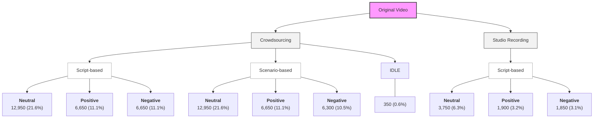

# KoDF: Large-Scale Korean Deepfake Detection Dataset

The KoDF dataset is a comprehensive collection of synthesized videos provided by AI-Hub, specifically designed to advance the detection of neural-network-based facial manipulations.

## Background: AI-Hub & NIA
AI-Hub is a national AI infrastructure platform operated by the National Information Society Agency (NIA) of South Korea. It serves as a cornerstone for South Korean AI development, providing high-quality datasets, software APIs, and computing resources to the public to foster innovation in the AI sector.

## Technical Specifications & Statistics
The dataset is characterized by its high volume and the diversity of its subjects, ensuring that detection models trained on this data are robust against various environmental and physiological factors.

## Data Statics

- [x] **Number of Subjects**: 400 participants
- [x] **Videos per Subject**: 150+ videos
- [x] **Total Data Duration**: 88.5 days
- [x] **Deepfake Model Variants**: 6 types

| Metric | Original Data | Fake Data |
| ------ | ------------- | --------- | 
| Total Videos | 62,166 | 175,776 |
| Average Video Length | 90+ second | 15+ second | 
| Total Duration | 1,500+ hours | 625+ hours|
| Resolution | 1920 X 1080 | 1920 X 1080 |
| FPS | 30 FPS | 30 FPS |
| Total Frames | 162,000,000+ | -- |

|  Column | Description | Example |
| ------- | ----------- | ------- |
| Video ID |  Unique identifer for the video  | 200715_23d3dsdfsdf34_1 | 
| User UUID | Unique identifier for the recorder | 23d3dsdfsdf001 |
| Start Date | Recording start timestamp | 2020.07.24:15.05.30 |
| Emotion Class | neutral, negative, positive | neutral |
| Label/Authenticity | Original(Real) vs Synthetic(Fake) | Real |
| Glasses | Presence of eyeglasses | No | 
| Idle State | Static frontal view without speech | True |
| Location | Indoor / Outdoor | Indoor |
| Light Source | Natural Light / Artificial light | Natural Light |
| Illumination Level | Bright, Medium, Low | Bright |
| Noise Level | Quiet, Moderate, Noisy | Quiet |

## How to Collect Data

### 1. Source Data Acquisition

The dataset utilizes **400 Korean participants** to ensure ethnic demographic accuracy.

**`Controlled Environment`**: <ins/>50 participants recorded in studio/home settings.</ins>

**`Crowdsourced`**: <ins/>350 participants recorded via mobile devices in diverse lighting/backgrounds.</ins>

**`Scripted Session`**: <ins/>Participants read specific passages to capture controlled lip movements.</ins>

**`Spontaneous Session`**: <ins/>Free-form Q&A to capture natural expressions and micro-movements.</ins>

---

### 2. Synthesis Techniques (6 Deepfake Models)

The dataset employs **six state-of-the-art (SOTA)** models categorized into two primary manipulation types:

####  
**The process of replacing the identity of a "target" person with a "source" person.**

**`DeepFaceLab`**: <ins/>The current industry standard for high-fidelity swaps using autoencoders.</ins>  

**`FaceSwap`**: <ins/>An accessible, popular tool utilizing GAN-based refinement for smoother blending.</ins>  

**`FSGAN`**: <ins/>A model that enables swapping without needing to train on specific image pairs.</ins>  

---
#### 
**The process of transferring motion, expressions, or speech patterns while keeping the target's identity.**

**`FOMM`**: <ins/>Uses a dense motion field to transfer expressions from a driving video to a source image.</ins>

**`3DMM`**: <ins/>Utilizes 3D geometry to manipulate facial mesh parameters for realistic changes.</ins>

**`Wav2Lip`**: <ins/>A specialized model ensuring generated lip movements match the audio input.</ins>

## Deep into MetaData

- [x] 원본영상_training_메타데이터.csv
- [x] 변조영상_training_메타데이터.csv
- [x] 원본영상_validation_메타데이터.csv
- [x] 변조영상_validation_메타데이터.csv

| Label | Train | Valid | Test | Total | 
| ----- | ----- | ----- | ---- | ----- |
|  | 139,951(79.50%) | 16,894(9.80%) | 18,971(10.70%) | 175,776 | 
|  | 49,419(79.62%) | 6,093(9.59%) | 6,654(10.79%) | 62,166 |

| Deepfake Model | Synthetic Video(Train) | Synthetic Video(Validation) |
|  ------------ | ------- | --------- |
|  `dfl` | 27,680 | 3,153 | 
|  `dffs` | 28,962 | 3,501 |
|  `fsgan` | 18,796 | 2,503 |
|  `fo`  | 49,586 |  5,853 |
|  `audio-driven` | 14,927 | 1,884 |
|  `total` | 139,951 | 16,894 | 